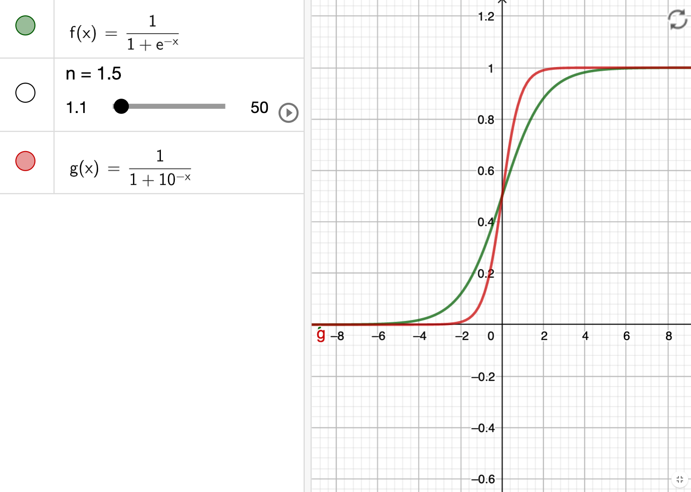
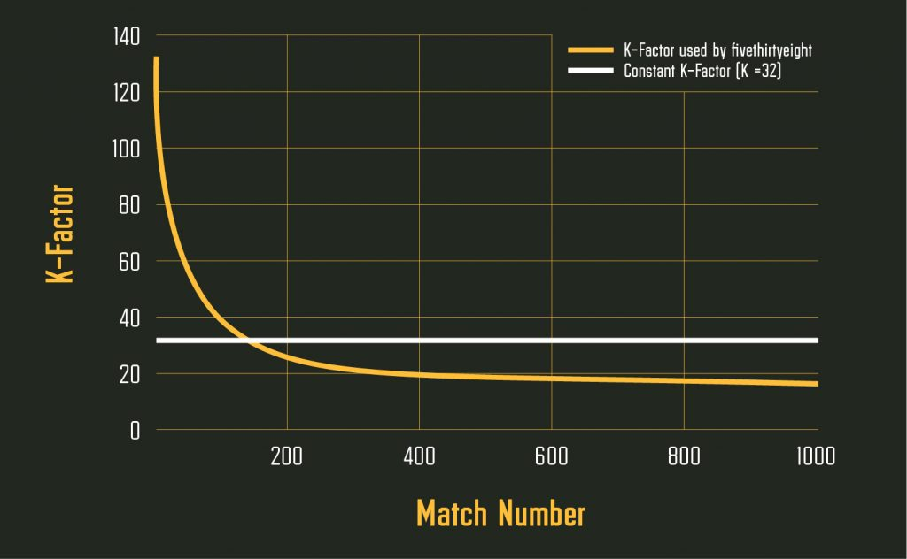

---

title: "What is ELO Model Actually"
last_modified_at: 2021-06-14:20:02-05:00
categories:
  - Statistics

---

When we talk about the forecasting in sports, ELO model is the most common thing. However, what is ELO actually? Based on Wikipedia, the Elo rating system is a method for calculating the relative skill levels of players such as chess. 

If team A plays against team B, the probability of win for team A is like the equation below. If the ELO score of team A and B are the same, then the probability of win is 50%, which make sense. 
$$
P_{Awin}=\frac{1}{1+10^{\left(ELO_{B}-ELO_{A}\right) / 400}}
$$
The formular is very simialr with logistic function (sigmoid function) with different base.
$$
f(x)=\frac{1}{1+e^{-x}} = \frac{e^{x}}{e^{x}+1}
$$
The plot shows the clear different between two equations, which brings us the next questions: why the base is 10 and why the score need to be divided by 400?

The way of updating the elo scores is shown as following. K is the factor that we need to give in advance. Initially, k is a constant number in different games (e.g. 40 or 32). When k is 40, that means maximum of elo score of each game is 40.
$$
\text {elo}_{new}=\mathrm{elo}_{old}+k\left(outcome-\operatorname{P}_{win}\right)
$$

One of solution is to use a dynamic K based on the number of matches in tennis. [read the artical here](https://www.betfair.com.au/hub/tennis-elo-modelling/)

### Resources

A few discussions about getting margin of outcome into models below. The idea is initially from autocorrelation in time series forecasting.

Steven Morse: Elo as a statistical learning model https://stmorse.github.io/journal/Elo.html

Steven Morse: Autocorrelation in Elo ratings https://stmorse.github.io/journal/Elo-2.html

538: Introducing NFL Elo Ratings https://fivethirtyeight.com/features/introducing-nfl-elo-ratings/

538: How Our NFL Predictions Work https://fivethirtyeight.com/methodology/how-our-nfl-predictions-work/

538: How We Calculate NBA Elo Ratings https://fivethirtyeight.com/features/how-we-calculate-nba-elo-ratings/

Autocorrelation definition in time series: https://otexts.com/fpp2/autocorrelation.html